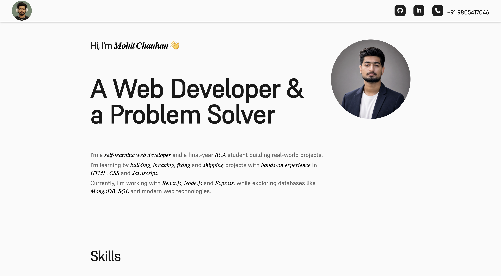
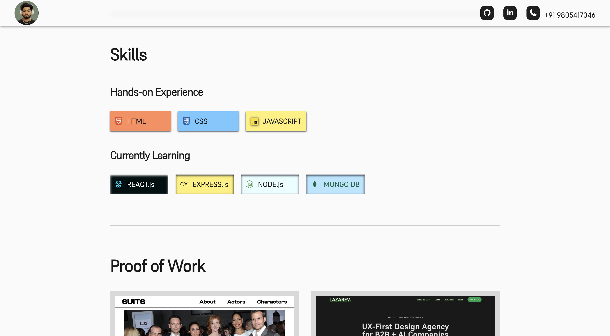
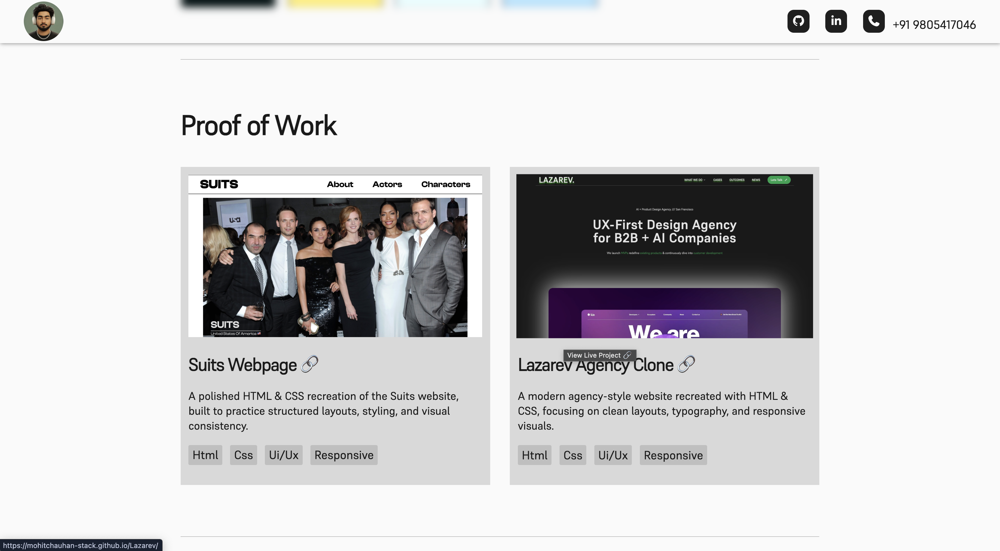
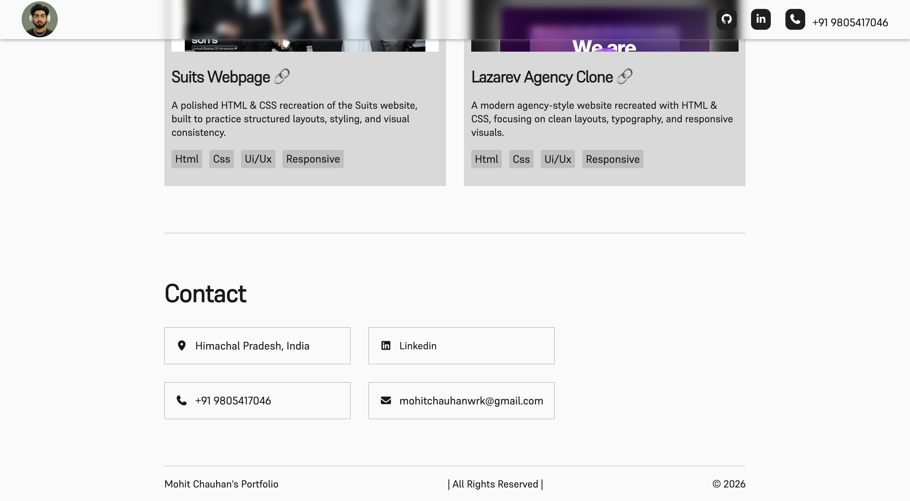

# Mohit's Portfolio

A clean and responsive personal portfolio website built to showcase my skills, projects, and web development journey.

## 🚀 Live Demo

[View Portfolio](https://mohitchauhan-stack.github.io/Portfolio_Mohit/)

## 🛠️ Built With

- HTML5
- CSS3
- Font Awesome
- Responsive Design
- Custom Fonts

## ✨ Features

- Responsive layout
- Personal introduction
- Skills showcase
- Project showcase
- Social & contact links
- Mobile-friendly design

## 📂 Projects Featured

- **Suits Webpage** — HTML & CSS recreation of the Suits website.
- **Lazarev Agency Clone** — Modern agency-style website recreated with HTML & CSS.

## 📸 Preview

## 📌 About

This portfolio was built as part of my journey as a self-learning web developer, focusing on improving my HTML, CSS, responsive design, and UI/UX skills.

## 👤 Author

**Mohit Chauhan**

- GitHub: [mohitchauhan-stack](https://github.com/mohitchauhan-stack)
- LinkedIn: [Mohit Chauhan](https://www.linkedin.com/in/mohit-chauhan-935a11387/)